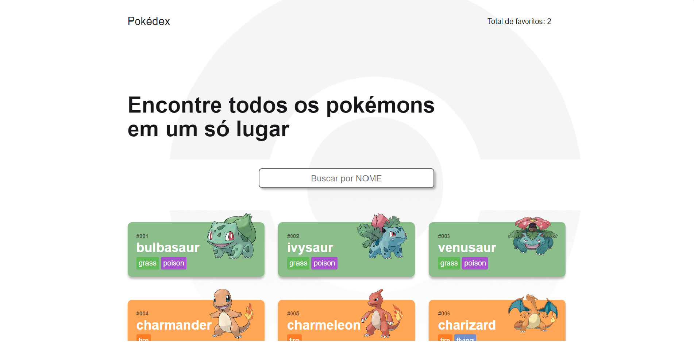

<h1 align="center"><strong>Pokédex<strong></h1>

## 📋 Enunciado

Projeto feito para estudo de React, onde foi realizado o consumo da API de Pokémons para prática de axios, redux e styled components.

## 🖥 Tecnologias

